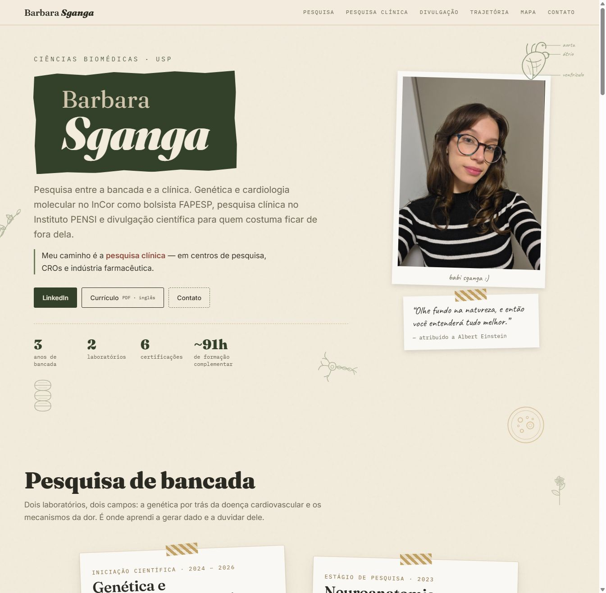
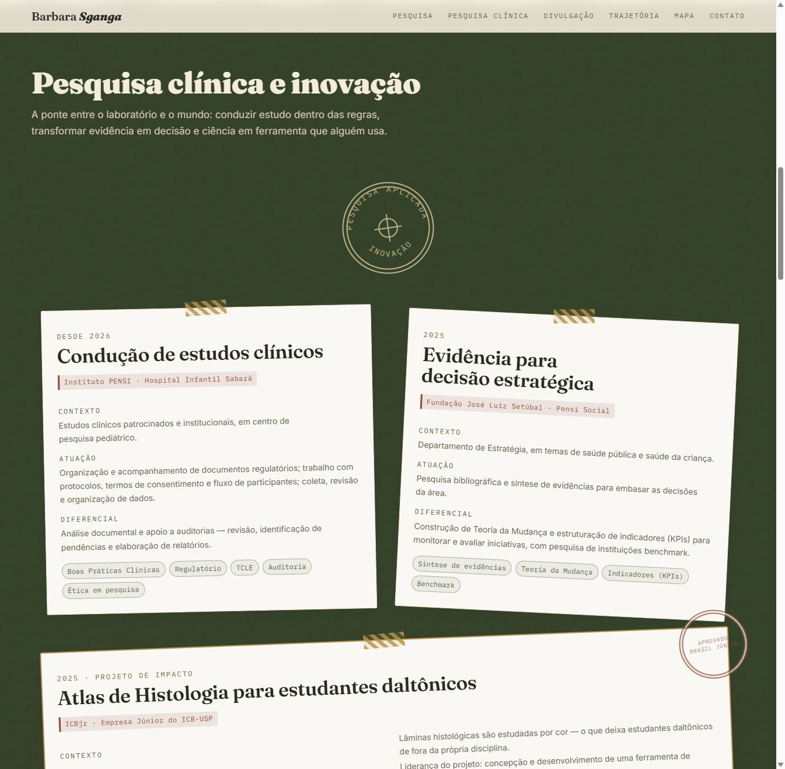
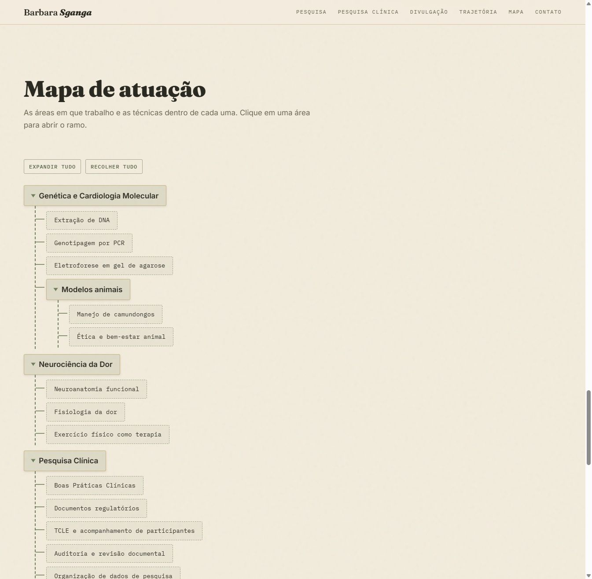

# Portfólio — Barbara Sganga

Portfólio científico de página única para Barbara Sganga, graduanda em
Ciências Biomédicas na USP. HTML, CSS e JavaScript puros — sem framework,
sem build. Presente para alguém próximo, construído do zero com Claude Code.

🔗 **Site publicado**: https://gustavocoelho1.github.io/barbara-portfolio/



---

## Como este projeto foi feito

Este README documenta o *processo*, não o produto — para decisões de
design e arquitetura técnica, ver [documents/DESIGN.md](documents/DESIGN.md)
e [documents/CONTEXT.md](documents/CONTEXT.md).

O site inteiro foi construído em conversa com o Claude Code, em sete etapas
que valem registrar porque moldaram decisões reais de escopo — nenhuma delas
foi "peça a IA para fazer um portfólio e pronto".

### 1 · Idealização

O pedido inicial já veio com uma restrição clara de propósito: não era um
portfólio para o dono do repositório, e sim um presente — o que muda o que
"terminado" significa. Também veio fechada, desde o início, a exigência mais
importante do projeto do ponto de vista de manutenção: cores e tema
precisavam ser **altamente manipuláveis**, para que ajustes finos de
cor/brilho pudessem ser feitos depois sem reabrir cada regra CSS.

### 2 · Wireframe

Um wireframe desenhado à mão (Excalidraw) definiu a ordem das seções, o
layout de cada uma e anotou explicitamente onde a interatividade deveria
viver — "árvore interativa, event delegation" no Mapa de Pesquisa, "animação
on-scroll" na Timeline. O wireframe foi lido e extraído programaticamente
(coordenadas + texto de cada elemento) para confirmar que o blueprint
seguinte era fiel a ele antes de qualquer linha de código.

### 3 · Blueprint

Um documento de blueprint em português, escrito à parte, formalizou a
direção de arte ("colagem científica de caderno de campo"), a paleta de seis
cores sem azul, a tipografia de quatro papéis, a biblioteca de técnicas
decorativas reutilizáveis (fita washi, polaroid, selo/carimbo, recorte de
papel rasgado) e — de forma explícita — o que **não** fazer: nada de
interatividade fora dos dois pontos de destaque, nada de dado fictício sem
rótulo, nada de rotação acima de 6°.

### 4 · Refinamento (antes de escrever código)

Antes da execução, três pontos ambíguos foram levados de volta ao usuário em
vez de decididos por suposição: nome da pasta/repositório (havia um
typo evidente), visibilidade do repositório no GitHub, e como tratar o nome
da pessoa no Hero enquanto ele ainda não estava confirmado. É neste ponto
também que entra a **calibração de esforço do agente**: para uma tarefa de
volume alto e sensível a composição visual (design system inteiro, várias
técnicas decorativas coordenadas), a recomendação foi Opus com effort alto —
não o nível máximo, porque o blueprint já tinha fechado as decisões e não
havia investigação incerta pela frente; não um nível menor, porque a
qualidade de composição era exatamente o que diferenciava o resultado.

### 5 · Execução

A V1 foi implementada inteira — tokens de design, seis seções, sprite SVG de
ilustrações, `script.js` com as três responsabilidades definidas no
blueprint — e então **verificada no navegador antes de ser considerada
pronta**, não só escrita e entregue. Essa verificação pegou bugs reais que a
leitura do código sozinha não mostraria: o recorte de papel rasgado virava
serrilhado em seções altas (o deslocamento estava em `%`, que escala com a
altura — corrigido para pixels fixos); um card claro dentro de uma seção
escura herdava texto claro e ficava ilegível sobre o próprio fundo; a camada
de aquarela do rodapé usava o `mix-blend-mode` errado para um fundo escuro e
simplesmente não aparecia.

### 6 · Enriquecimento de escopo com dados reais

Depois da V1 pronta, dois novos insumos chegaram juntos: o currículo real da
Barbara (PDF em inglês) e uma referência visual nova mostrando o estilo de
colagem científica desejado — gravura anatômica, prancha botânica, notas
manuscritas. Isso disparou a mudança de maior impacto do projeto, em duas
frentes simultâneas:

- **Conteúdo**: o blueprint original tratava a pessoa como pesquisadora
  sênior; o currículo real revelou uma graduanda com uma trajetória mais
  interessante do que a genérica prevista — bancada molecular (bolsa FAPESP
  no InCor), pesquisa clínica regulada (Boas Práticas Clínicas no Instituto
  PENSI) e liderança de um projeto de impacto (Atlas de Histologia para
  estudantes daltônicos, aprovado pela Brasil Júnior). As seções foram
  reestruturadas para contar *essa* história, e os dois cases fictícios da
  V1 — que existiam só para "mostrar potencial" — saíram por completo,
  substituídos por três cases reais.
- **Visual**: a biblioteca inteira de ilustrações foi refeita do zero, de
  traço geométrico simples para gravura de linha fina no estilo da nova
  referência — coração anatômico com chamadas manuscritas, neurônio,
  dupla-hélice, ramo botânico.



### 7 · Resultado

O fechamento revisitou o que já estava no ar com olhar crítico, não só
adicionou funcionalidade nova. Isso incluiu reverter uma decisão: uma
implementação completa de entrega de formulário por serviço de terceiro foi
construída, testada — e depois desfeita a pedido do usuário, que preferiu
manter o comportamento original (`mailto:`) quando entendeu que ele já fazia
o que precisava. Registrar essa reversão no [CONTEXT.md](documents/CONTEXT.md)
foi tão deliberado quanto registrar o que ficou.



---

## Como abrir

```bash
python -m http.server 5500
```

Ou simplesmente abra `index.html` no navegador — não há dependências.

Para customizar cores/brilho, adicionar conteúdo ou entender a arquitetura,
ver [documents/DESIGN.md](documents/DESIGN.md) e
[documents/CONTEXT.md](documents/CONTEXT.md).

## Publicação

Repositório público no GitHub, publicado via GitHub Pages a partir da branch
`main` — https://github.com/GustavoCoelho1/barbara-portfolio
